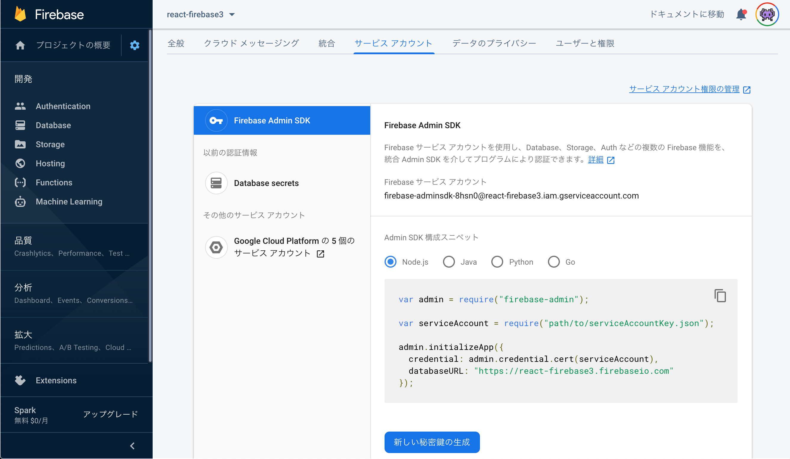

# React Cloudfunctions Firebase Tutorial

作成日：2020/06/07

更新日：2020/06/07

---
## 今回の講座のゴール
---

- フロントはReact，サーバはCloudFunctions（Node.js），DBはCloud Firestoreを用いたアプリケーションが手元のある状態．
- 何やってるかをできる限り自分の言葉でコメントする．
- フロント，サーバともにJavaScriptの構成でなにか作れそうな感覚を得る．

---
## 今回作成するアプリケーション
---

- 前回のtodoリストのCRUD処理をCloudFunctionsを用いたREST APIとして実装する．
- フロント側の動作は前回と同じ（処理はaxiosによるhttpリクエストに変更）．

---
## 【必須】事前準備
---

- 前回のライブ講義で作成したtodoリストを動く状態にしておく．
- 前回のライブ講義で作成したFirebaseのプロジェクト（資料では`react-firebase`）のコンソールページを開いておく．

---
## 今回の内容の前提
---

前回のライブ講義とNode.jsオンライン講座と課題を完了していればOK！

- `React`を用いた基礎的な実装を行った経験がある．
- `CloudFunctions(Node.js)`と`Express`を用いた開発とデプロイの経験がある．
- REST API（http通信）の仕組みがなんとなくわかる．

---

- 【参考】これまでの内容

- [React事前講座](https://github.com/taroosg/react-tutoriia)

- [Reactオンラインライブ講座](https://github.com/taroosg/react-firebase-tutorial)

- [CloudFunctions事前講座](https://github.com/taroosg/cloudfunctions-express-tutorial)

---
## 環境構築（CloudFunctions）
---
### 必要なツールのバージョン確認
---

- Node.jsとnpmが必要なので，以下のコマンドで状況を確認する．
- バージョンが表示されればOK．
```bash
$ node -v
v12.15.0
$ npm -v
6.14.5
```

---
### プロジェクトの作成
---

- `cloudfunctions-firebase`という名前でプロジェクトを作成する．
- 今回は例としてデスクトップに作成しているが任意の場所でOK．
- 下記コマンドを順番に実行．

---

```bash
$ cd ~/Desktop
$ mkdir cloudfunctions-firebase
$ cd cloudfunctions-firebase
$ firebase init
```

---

- `functions`を選択（スペースキー）してEnter．

```bash
? Which Firebase CLI features do you want to set up for this folder? Press Space
 to select features, then Enter to confirm your choices.
 ◯ Database: Deploy Firebase Realtime Database Rules
 ◯ Firestore: Deploy rules and create indexes for Firestore
❯◉ Functions: Configure and deploy Cloud Functions
 ◯ Hosting: Configure and deploy Firebase Hosting sites
 ◯ Storage: Deploy Cloud Storage security rules
 ◯ Emulators: Set up local emulators for Firebase features
```

---

- `Use an existing project`にカーソルを合わせてEnter．

```bash
? Please select an option: (Use arrow keys)
❯ Use an existing project
  Create a new project
  Add Firebase to an existing Google Cloud Platform project
  Don't set up a default project
```

---

- 前回のライブ講義で使用したプロジェクトにカーソルを合わせてEnter．

```bash
? Select a default Firebase project for this directory:
  hoge-216007 (hoge)
  hogehoge (hogehoge)
  fuga-1d565 (fuga)
❯ react-firebase (react-firebase)
  fugafuga (fugafuga)
  piyo-r359f (piyo)
  piyopiyo (piyopiyo)
```

---

- `JavaScript`にカーソルを合わせてEnter．

```bash
? What language would you like to use to write Cloud Functions? (Use arrow keys)

❯ JavaScript
  TypeScript
```

---

- `n`->`y`の順に入力&Enterして完了！

```bash
? Do you want to use ESLint to catch probable bugs and enforce style? No
✔  Wrote functions/package.json
✔  Wrote functions/index.js
✔  Wrote functions/.gitignore
? Do you want to install dependencies with npm now? Yes
...
✔  Firebase initialization complete!
$
```

---

### 動作確認
- エディタで作成したプロジェクトを開く．
- `functions/index.js`を開き，下記のように編集する．

```js
// index.js
const functions = require('firebase-functions');

// ↓↓↓ コメント外す ↓↓↓
exports.helloWorld = functions.https.onRequest((request, response) => {
 response.send("Hello from Firebase!");
});
```

---

- 編集したらローカルサーバを立ち上げて．．．
- （ローカルサーバのURLはメモしておくと良い．）

```bash
$ firebase serve
...
✔  functions[helloWorld]: http function initialized (http://localhost:5000/react-firebase/us-central1/helloWorld).
```

---

- ターミナルからリクエストを送信！
- `Hello from Firebase!`が返ってくればOK！

```bash
$ curl http://localhost:5000/react-firebase/us-central1/helloWorld
Hello from Firebase!
```

---

### `Express`と`cors`の導入

---

- 【重要】functionsフォルダに移動しておく．
- 下記コマンドを実行してインストールする．

```bash
$ cd functions
$ npm install express
$ npm install cors
```

---

- インストールが終わったらindex.jsを編集する．

```js
const functions = require('firebase-functions')
const express = require("express");
const cors = require('cors');

const app = express();
app.use(cors());

app.get('/hello', (req, res) => {
  res.send('Hello Express!');
});

const api = functions.https.onRequest(app);
module.exports = { api };
```

---

- ローカルサーバを立ち上げて．．．

```bash
$ firebase serve
...
✔  functions[api]: http function initialized (http://localhost:5000/react-firebase/us-central1/api).
```

---

- ターミナルからリクエスト送信！
- `Hello Express!`が返ってくればOK！

```bash
$ curl http://localhost:5000/react-firebase/us-central1/api/hello
Hello Express!
```

---
## CloudFunctionsとCloudFirestoreの通信の準備
---
### 必要なファイルのダウンロード
---

- Firebaseのコンソールにアクセスし，今回のプロジェクトのページを表示．
- ⚙ -> `プロジェクトを設定` で設定画面を表示．
- `サービスアカウント` -> `新しい秘密鍵を作成` の順にクリック．
- 適当な場所にjsonファイルを保存する．
- コンドール画面は開いたままにしておこう．



---
### jsonファイルの配置と構成ファイルの作成
---

- `functions`ディレクトリの中に`model`ディレクトリを作成する．
- `model`ディレクトリの中に↑でダウンロードしたjsonファイルを移動する．
- `model`ディレクトリの中に`firebase.js`ファイルを作成する．

---

- `firebase.js`ファイルに↑で開いたコンソール画面から`Admin SDK構成スニペット`をコピペする．
- `var serviceAccount = require("...");`の部分の`require()`内を`jsonファイルのパス`に書き換える．
- 最下行に`module.exports = admin;`を追記する．

```js
// firebase.js
var admin = require("firebase-admin");

var serviceAccount = require("./react-firebase-firebase-adminsdk-8hsn0-hogehoge.json");

admin.initializeApp({
  credential: admin.credential.cert(serviceAccount),
  databaseURL: "https://react-firebase.firebaseio.com"
});

module.exports = admin;
```

---
## FunctionsとFirestoreの通信確認（Readの処理）
---
### エンドポイントの作成とデータ取得
---

- CRUD処理に対応するエンドポイントを作成する．
- 続いて，Firestoreのデータを全件取得する処理を追記し，動作を確認する．

---

- まず，`index.js`に下記のようにCRUDのエンドポイント4つを作成する．
- firestore関連のモジュール読み込みも行う．

```js
// index.js
const functions = require('firebase-functions')
const express = require("express");
const cors = require('cors');
// ↓↓↓ 追記 ↓↓↓
const admin = require('./model/firebase');
const db = admin.firestore();
// ↑↑↑ 追記 ↑↑↑

const app = express();
app.use(cors());

// get all items
app.get('/', async (req, res, next) => {
  res.json('todo get endpoint')
});

// post item
app.post('/', async (req, res, next) => {
  res.json('todo post endpoint')
});

// update item
app.put('/:id', async (req, res, next) => {
  res.json('todo put endpoint')
});

// delete item
app.delete('/:id', async (req, res, next) => {
  res.json('todo delete endpoint')
});

const api = functions.https.onRequest(app);
module.exports = { api };
```

---

- 続いて，Firestoreのアイテムを全件取得する処理を追記する．

```js
// index.js
// ...省略
// get all items
app.get('/', async (req, res, next) => {
  try {
    const todoSnapshot = await db.collection('todos')
      .orderBy('isDone', 'asc')
      .orderBy('limit', 'asc')
      .get();
    const todos = todoSnapshot.docs.map(x => {
      return {
        id: x.id,
        data: x.data()
      };
    })
    res.json(todos);
  } catch (e) {
    next(e);
  }
});
// ...省略
```

---

- ローカルサーバを立ち上げて．．．

```bash
$ firebase serve
✔  functions[api]: http function initialized (http://localhost:5000/react-firebase/us-central1/api).
```

---

- ターミナルからリクエストを送信！
- Firestoreに保存されているデータがJSONになって返ってくればOK！

```bash
$ curl http://localhost:5000/react-firebase/us-central1/api/
[
  {
    "id": "dY8pOkIUEXTOGC5LbObZ",
    "data": {
      "isDone": false,
      "limit": {
        "_seconds": 1590786000,
        "_nanoseconds": 0
      },
      "todo": "Node.js課題"
    }
  },
  ...
]
```

---
### デプロイ
---

- 下記コマンドでデプロイする．
- デプロイ先のURLはメモしておくと良い．

```bash
$ firebase deploy
...
✔  functions[api(us-central1)]: Successful create operation.
Function URL (api): https://us-central1-react-firebase.cloudfunctions.net/api

✔  Deploy complete!
```

---

- ターミナルからリクエスト送信して．．．
- Firestoreに保存されているデータがJSONになって返ってくればOK！

```bash
$ curl https://us-central1-react-firebase.cloudfunctions.net/api/
[
  {
    "id": "dY8pOkIUEXTOGC5LbObZ",
    "data": {
      "isDone": false,
      "limit": {
        "_seconds": 1590786000,
        "_nanoseconds": 0
      },
      "todo": "Node.js課題"
    }
  },
  ...
]
```


今回はここまで( `･ω･)b